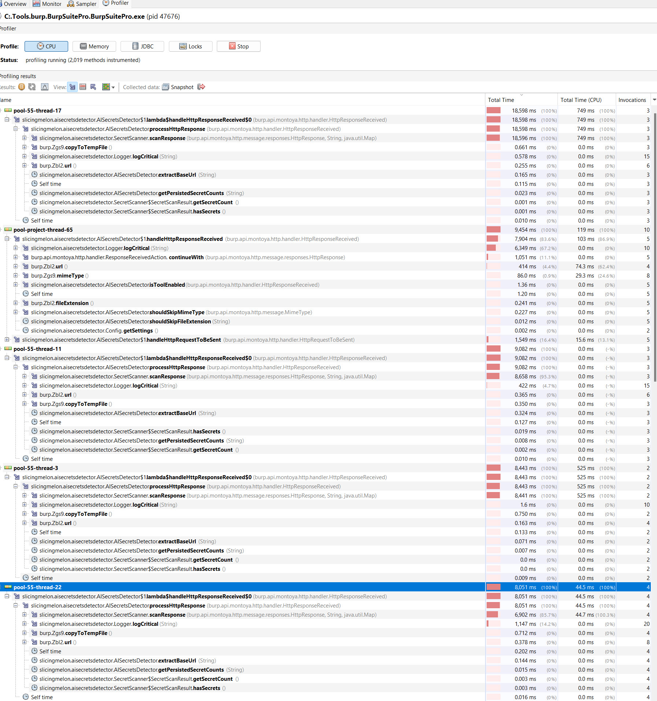
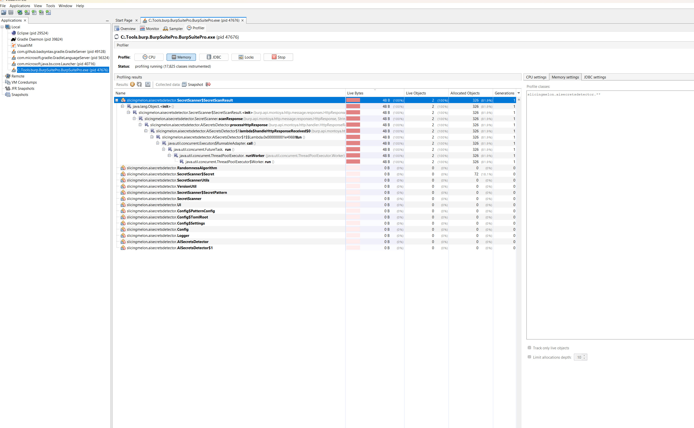

# Performance

Here I log some benchmarks and profiling output.

## CPU Profiling

It takes around ~18ms to scan a response. This includes:

✅ Pattern matching across multiple regex patterns 
✅ String/ByteArray processing for position finding 
✅ Counter lookups in persistent storage 
✅ Secret object creation and marker positioning 
✅ Audit issue creation (when secrets found) 

### Performance Analysis:

- 18ms × 25 threads = Massive Throughput
- Sequential processing: 55 responses/second (1000ms ÷ 18ms)
- With 25 threads: ~1,375 responses/second (55 × 25)
  
### Breakdown Estimate

- Pattern matching: ~8-12ms
- Position finding: ~2-4ms
- Counter checking: ~1-2ms
- Object creation: ~1-2ms

### Comparison

- TruffleHog: Often 50-200ms per file
- GitLeaks: ~10-60ms per individual file (excluding startup overhead)
- Burp Secrets Detector: 18ms for full HTTP response analysis

## Memory

### Key Memory Allocations:

**SecretScanner.Secret objects (264 B)**: Main allocation for detected secrets
- Only created for secrets that pass threshold filtering
- Memory-efficient design prevents wasteful object creation

**RandomnessAlgorithm (0 B)**: Excellent optimization
- Uses pure mathematical operations (entropy calculations, frequency analysis)
- No object allocation = maximum efficiency
- Processes high-volume traffic without memory overhead

### Memory Optimizations Implemented:

✅ Eliminated expensive site map traversal: Removed redundant scanning of existing audit issues 
✅ Persistent counter optimization: Use cached counts instead of re-scanning markers 
✅ Threshold filtering**: Only create Secret objects for reportable findings 
✅ `copyToTempFile()` usage: Move large objects to filesystem instead of heap 
✅ Efficient threading: 25 worker threads with controlled object lifecycle 

### Memory Profiler Limitations:

Memory profilers track **object allocations** but miss:
- **Temp file storage**: Our copyToTempFile() optimizations use native filesystem
- **Primitive operations**: Mathematical computations don't create objects
- **Native ByteArray internals**: Burp's internal memory management
- **JVM overhead**: Framework-level memory usage

### Result:

The extension maintains low memory footprint even under high-volume monitoring:
- No memory leaks from repeated secret scanning
- Efficient object creation only when necessary
- Native temp file storage for large HTTP objects
- Mathematically optimized randomness detection

